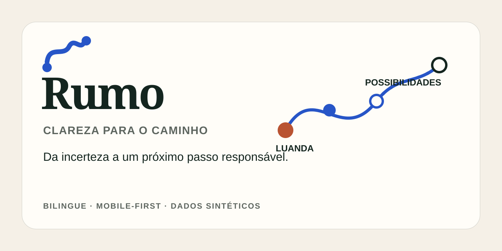

<p align="center">
  
</p>

<p align="center">
  <strong>Protótipo público · Mobile-first · Português e inglês · Dados sintéticos</strong>
</p>

Rumo ajuda estudantes angolanos a transformar a incerteza de estudar fora num percurso compreensível. O protótipo organiza análise, oportunidades e próximos passos sem prometer admissão nem esconder o que ainda precisa de confirmação.

<p align="center">
  
</p>

## O que demonstra

- um percurso value-first: onboarding e análise antes do registo demonstrativo;
- estados `confirmado`, `estimado` e `por verificar`, distintos sem depender apenas da cor;
- oito ecrãs responsivos em português e inglês;
- perfil, instituições e oportunidades inteiramente sintéticos;
- respostas mantidas apenas durante a sessão do navegador;
- PWA instalável, movimento reduzido e navegação por teclado.

## Executar localmente

Requer Node.js 22.

```bash
npm install
npm run dev
```

Verificação completa:

```bash
npm run check
```

## Percurso implementado

`Landing → Onboarding → Análise → Guardar protótipo → Dashboard → Descoberta → Detalhes → Plano`

Cada ecrã mantém uma tarefa dominante. A rota, os marcadores de evidência e a relação Luanda–destino formam a identidade Personal Atlas.

## Limites responsáveis

- Não existe autenticação, backend, pagamento ou submissão real.
- Nenhum dado real de estudante ou instituição entra no protótipo.
- Compatibilidade não significa elegibilidade nem admissão.
- Custos, prazos, bolsas, equivalências e requisitos exigem confirmação na fonte oficial.
- Os eventos de progressão permanecem no navegador e não contêm respostas do perfil.

## Documentação

- [Visão do produto](docs/product-brief.md)
- [Fluxo de utilização](docs/user-flow.md)
- [Decisões de design](docs/design-decisions.md)
- [Direção Personal Atlas](docs/personal-atlas-direction.md)
- [Plano de validação](docs/validation-plan.md)
- [QA visual](docs/qa/visual-qa-2026-09-29.md)
- [Contraste](docs/qa/contrast.md) e [desempenho](docs/qa/performance.md)
- [Pesquisa bilingue](docs/research-survey.md)

## Estado

O projeto está numa fase de protótipo público para validação e portefólio. A publicação não representa um serviço de aconselhamento, admissão ou candidatura.

As regras de contribuição automatizada estão em [AGENTS.md](AGENTS.md).
