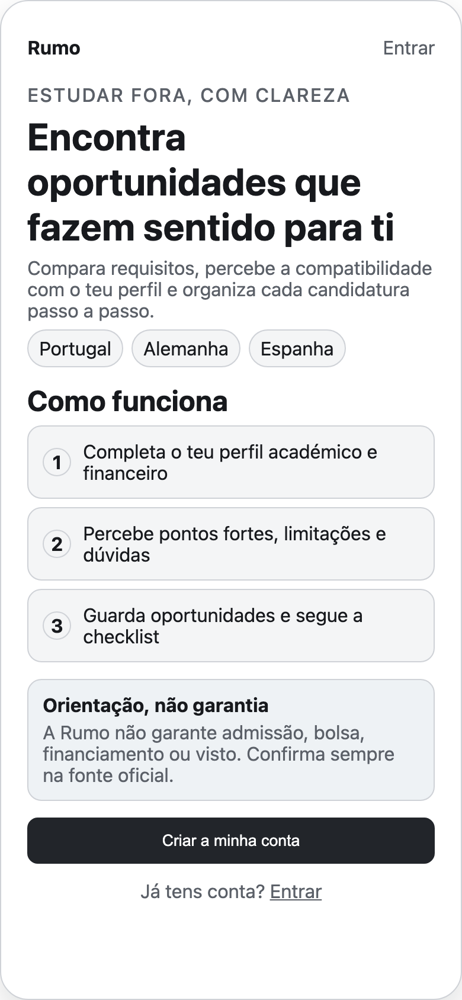
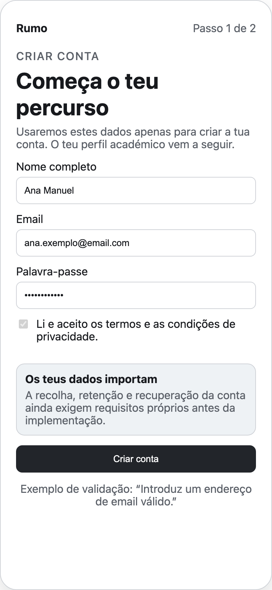
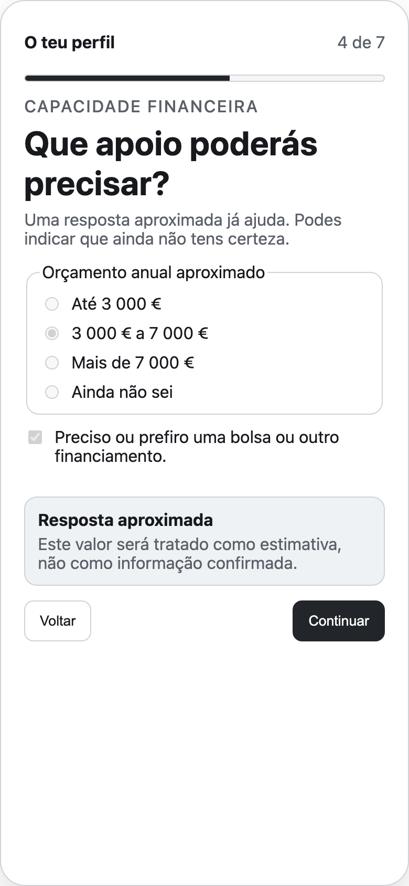
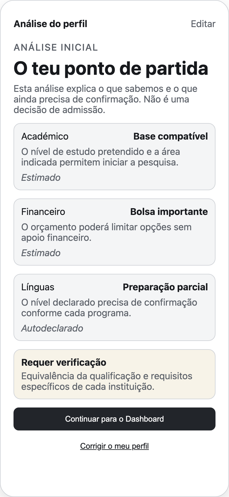
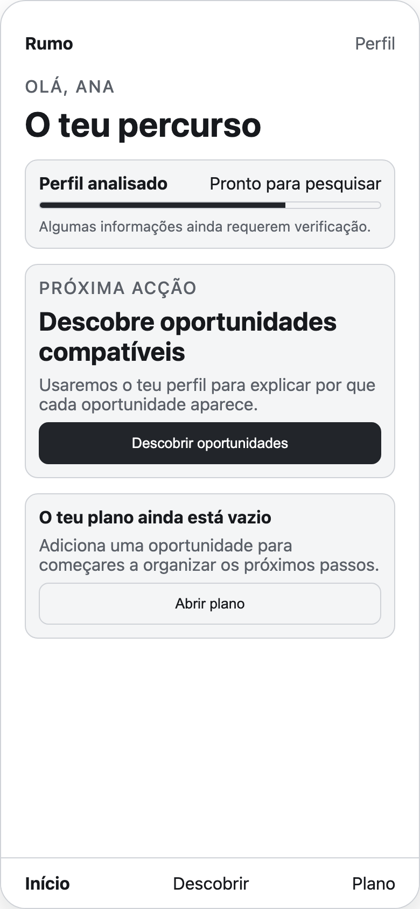
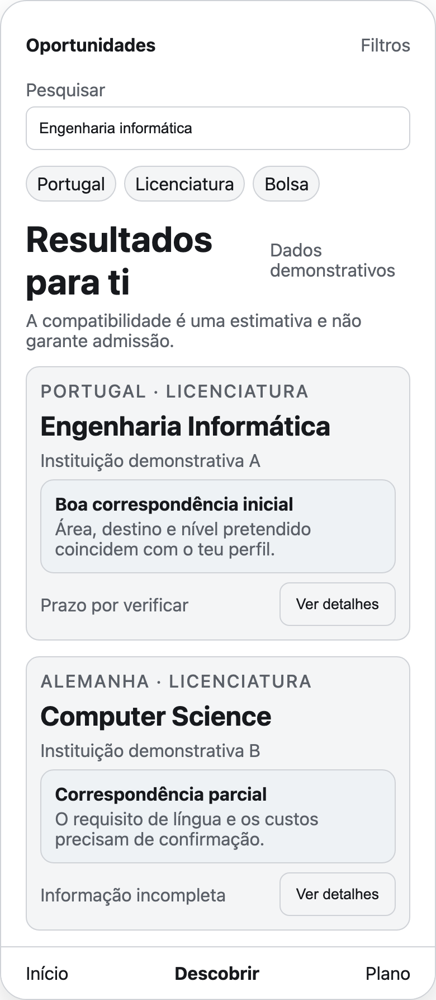
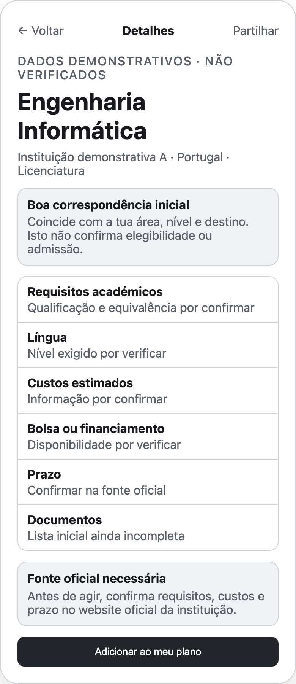
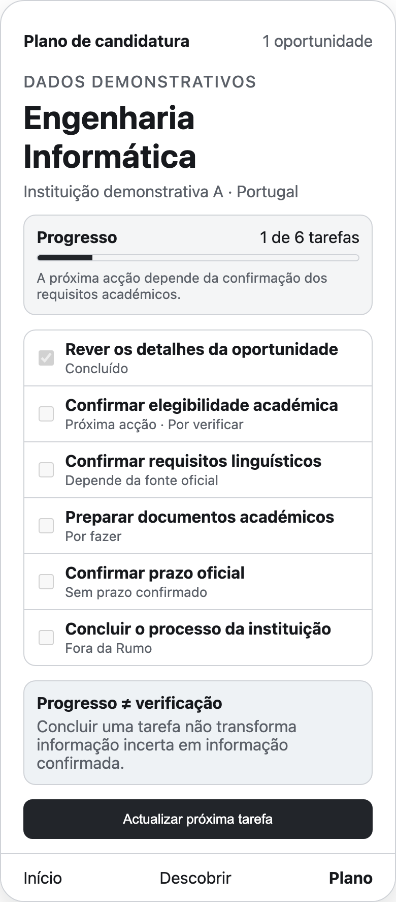

# Wireframes do MVP

## Estado do documento

- **Versão:** 0.1
- **Data:** 8 de agosto de 2026
- **Estado:** Pending review
- **Âmbito:** oito ecrãs mobile-first do MVP
- **Fonte canónica de fluxo:** [`docs/user-flow.md`](./user-flow.md)
- **Fonte de verdade para design:** [Rumo — MVP Wireframes v1.0 no Figma](https://www.figma.com/design/dCYPl6m4YvlnrDSAsKWHzP)
- **Fluxo aprovado:** [UF-01 — Fluxo canónico MVP no FigJam](https://www.figma.com/board/DIXxIYHOC7CMFnwB1s4j8U)

> Estes wireframes são uma proposta de baixa fidelidade para revisão. Os PNGs facilitam a consulta no GitHub; o Figma continua a ser a fonte de verdade para design. Não representam implementação, visual design final ou dados institucionais verificados.

## Princípios aplicados

- Mobile-first, com foco em estudantes angolanos que podem usar principalmente o telemóvel.
- Português claro e adequado ao contexto angolano.
- Apenas os oito ecrãs confirmados para o MVP.
- Dados fictícios identificados como “demonstrativos”, “não verificados”, “estimados” ou “por confirmar”.
- Compatibilidade explicada como orientação, nunca como garantia de admissão.
- Progresso de tarefas separado do estado de verificação da informação.
- Acção principal e estados alternativos essenciais visíveis em cada ecrã.

## S01 — Landing page

**Acção principal:** Criar a minha conta → S02.  
**Estado alternativo essencial:** entrar numa conta existente ou sair sem registo.

## S02 — Registo

**Acção principal:** Criar conta → S03.  
**Estado alternativo essencial:** validação de email, consentimento em falta ou erro recuperável.

## S03 — Onboarding do estudante

**Acção principal:** Continuar até pedir a análise → S04.  
**Estado alternativo essencial:** resposta aproximada, “Ainda não sei”, voltar ou retomar progresso.

## S04 — Análise do perfil

**Acção principal:** Continuar para o Dashboard → S05.  
**Estado alternativo essencial:** corrigir perfil → S03 → S04.

## S05 — Dashboard

**Acção principal:** Descobrir oportunidades → S06.  
**Estado alternativo essencial:** plano vazio, abrir o plano ou rever a análise.

## S06 — Descoberta de oportunidades

**Acção principal:** Ver detalhes → S07.  
**Estado alternativo essencial:** zero resultados, informação incompleta ou filtros sem correspondência.

## S07 — Detalhes da oportunidade

**Acção principal:** Adicionar ao meu plano → S08.  
**Estado alternativo essencial:** já adicionada, falha ao guardar ou regresso à descoberta.

## S08 — Plano de candidatura

**Acção principal:** actualizar a próxima tarefa no próprio plano.  
**Estado alternativo essencial:** plano vazio → S06, prazo por verificar ou erro ao guardar.

## Critérios de revisão

- [ ] Os oito ecrãs correspondem exactamente a S01–S08 do fluxo canónico.
- [ ] A hierarquia e as acções principais são compreensíveis em telemóvel.
- [ ] Nenhum ecrã ou funcionalidade fora do MVP foi introduzido.
- [ ] Estados de vazio, validação, erro e incerteza são suficientes para a jornada.
- [ ] Copy não promete admissão, bolsa, financiamento ou visto.
- [ ] Dados demonstrativos nunca parecem informação verificada.
- [ ] A revisão no Figma e esta documentação permanecem alinhadas.

## Fora do âmbito

- identidade visual final;
- protótipo navegável de alta fidelidade;
- implementação funcional;
- regras reais de elegibilidade;
- informação verificada de universidades, bolsas, prazos ou vistos.
